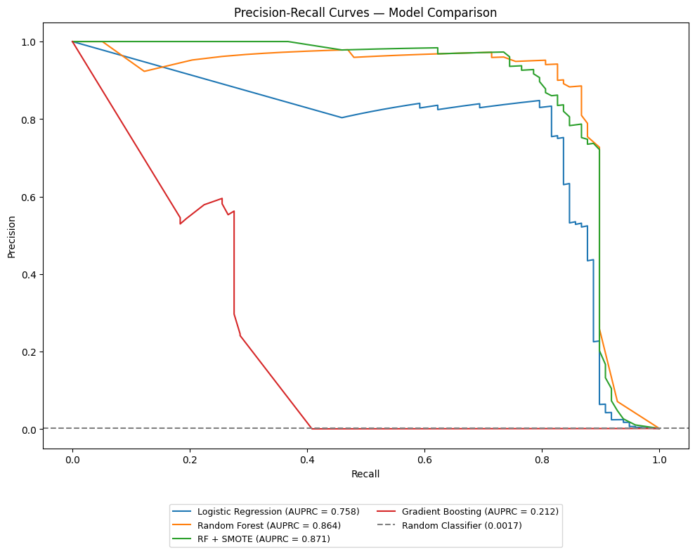
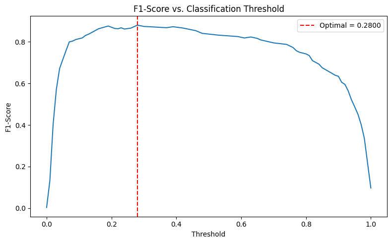
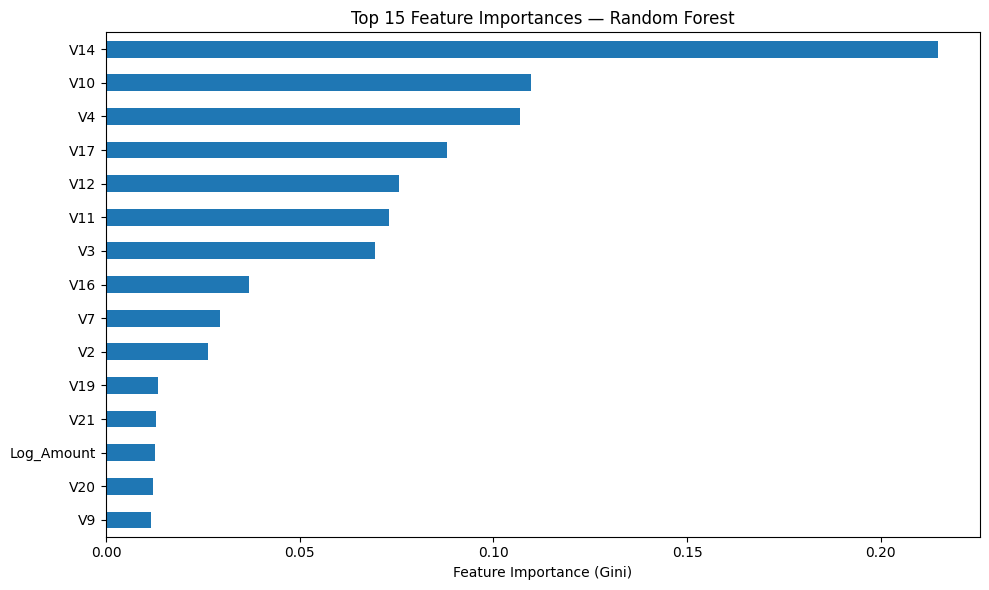

# FraudGuard: Credit Card Fraud Detection

Detecting fraudulent card transactions in a highly imbalanced dataset, framed around the trade-off a bank actually faces: missed fraud (direct loss) versus false alarms (investigation cost and customer friction).

*Team project for TCX3212 Predictive Analytics, National University of Singapore (AY2025/26 Sem 2).*
*Team: Arun Radhakrishnan, Muhammad Syamil, Niyas Ahamed, Shthesd Kanan.*

## The problem

The [MLG-ULB Credit Card Fraud dataset](https://www.kaggle.com/datasets/mlg-ulb/creditcardfraud) contains 284,807 transactions, of which only 492 (0.17%) are fraud. A model that labels everything "legitimate" is 99.8% accurate and completely useless, so accuracy is the wrong metric here.

## Approach (CRISP-DM)

- **Metric:** Area Under the Precision-Recall Curve (AUPRC) as the primary metric, with precision, recall and F1 as supporting metrics.
- **Imbalance handling:** class weighting, plus SMOTE applied to the **training data only** to prevent leakage into the test set.
- **Feature engineering:** log-transformed `Amount` to reduce skew, and `Time` converted to hour of day.
- **Scaling:** StandardScaler for Logistic Regression only; tree models trained on unscaled data.
- **Validation:** stratified train-test split and cross-validation.
- **Decision threshold:** tuned on F1 instead of the default 0.5.

## Results

| Model | AUPRC |
|---|---|
| Logistic Regression (balanced class weights) | 0.757 (CV: 0.742) |
| **Random Forest (balanced class weights)** | **0.864** (CV: 0.849) |
| Random Forest + SMOTE | 0.871 (CV: 0.846) |
| Gradient Boosting (no imbalance handling) | 0.212 (CV: 0.556) |



**Recommended model: class-weighted Random Forest.** RF + SMOTE scored slightly higher on the single train-test split, but class weighting alone did better in cross-validation, with less complexity.

**At a tuned threshold of 0.28** (instead of the default 0.5), on a held-out test set of 56,962 transactions:

| | Predicted legit | Predicted fraud |
|---|---|---|
| **Actual legit** | 56,859 | 5 |
| **Actual fraud** | 17 | 81 |



Precision 0.942, recall 0.827, F1 0.880: 81 of 98 fraud cases caught, with only 5 false alarms.

**Cost-benefit:** assuming a $9.25 loss per missed fraud (the median fraud amount in the dataset, a conservative choice) and $5 investigation cost per false alarm, the model avoids $724.25 of the $906.50 in fraud losses on the test set, about 80% net of investigation costs.

**Top predictors:** V14, V10 and V4 (Random Forest Gini importance).



## Key takeaways

1. **Class weighting is enough.** SMOTE's small train-test gain (0.871 vs 0.864) disappeared under cross-validation (0.846 vs 0.849), so it adds complexity without meaningful benefit.
2. **Imbalance handling matters more than algorithm choice.** Gradient Boosting, trained without any imbalance handling, scored 0.212, well below even the linear baseline.
3. **Threshold is a business decision.** At a 0.17% fraud rate the default 0.5 is rarely right; the operating point should reflect the bank's cost of missed fraud versus false alarms.

## Limitations

- The features V1–V28 are PCA-anonymised, which limits explainability, a real constraint for model risk review in banks.
- The data is historical and fraud patterns drift, so a deployed model would need monitoring and retraining.

## Future work

Time-based validation, XGBoost with imbalance handling, behavioural features (transaction frequency, spending patterns), and SHAP for explainability.

## How to run

```bash
pip install -r requirements.txt
# Download creditcard.csv from Kaggle into the repo root (not included, 144 MB)
jupyter notebook fraudguard.ipynb
```
